# 🏨 Hotel Annapurna - Entity Relationship Diagram

```mermaid
erDiagram
    %% Users and Authentication
    users {
        int id PK
        varchar_50 first_name
        varchar_50 last_name
        varchar_100 email UK
        varchar_20 contact
        varchar_255 password
        varchar_255 profile_pic
        text address
        enum_role role "admin,staff,customer"
        enum_status status "pending,verified,suspended"
        decimal_10_2 salary
        timestamp created_at
        timestamp updated_at
    }

    %% Core Business Entities
    food_items {
        int id PK
        enum_category category "veg,non-veg,special"
        varchar_100 food_name
        decimal_10_2 price
        decimal_10_2 discount_price
        varchar_255 image_path
        varchar_200 available_days
        text short_description
        timestamp created_at
        timestamp updated_at
    }

    rooms {
        int id PK
        varchar_255 image_path
        varchar_50 room_no UK
        enum_type room_type "single,double,deluxe,suite"
        int total_beds
        enum_bed_size bed_size "single,double,queen,king"
        enum_status status "available,booked,reserved,maintenance,occupied"
        decimal_10_2 price
        decimal_10_2 price_today
        text amenities
        text short_description
        timestamp created_at
        timestamp updated_at
    }

    tables {
        int id PK
        varchar_255 image_path
        varchar_50 table_no UK
        int total_chairs
        enum_status booking_status "available,booked,reserved,maintenance,occupied"
        decimal_10_2 price_main
        decimal_10_2 price_today
        enum_location location "ground floor,first floor,outside,inside"
        text short_description
        timestamp created_at
        timestamp updated_at
    }

    %% Content Management
    blogs {
        int id PK
        varchar_255 title
        varchar_100 category
        varchar_255 tags
        text content
        varchar_255 featured_image
        int views
        int author_id FK
        enum_status status "draft,published,archived"
        timestamp created_at
        timestamp updated_at
    }

    blog_interactions {
        int id PK
        int blog_id FK
        int user_id FK
        enum_type interaction_type "like,comment,share"
        text comment_text
        int rating "1-5"
        timestamp created_at
        timestamp updated_at
    }

    %% Transactions and Orders
    orders {
        int id PK
        int user_id FK
        enum_type order_type "food,room,table"
        int item_id
        varchar_255 item_name
        int quantity
        decimal_10_2 price
        enum_payment_method payment_method "cash,esewa,khalti,card"
        enum_payment_status payment_status "pending,paid,failed"
        varchar_50 booking_reference
        enum_status status "pending,confirmed,completed,cancelled"
        text notes
        timestamp created_at
        timestamp updated_at
    }

    cart_items {
        int id PK
        int user_id FK
        enum_type item_type "food,room,table"
        int item_id
        json item_data
        int quantity
        timestamp created_at
        timestamp updated_at
    }

    %% Marketing and Support
    coupons {
        int id PK
        varchar_50 code UK
        enum_type discount_type "percentage,fixed"
        decimal_10_2 discount_value
        decimal_10_2 min_purchase
        decimal_10_2 max_discount
        int usage_limit
        int used_count
        datetime valid_from
        datetime valid_until
        enum_status status "active,inactive"
        timestamp created_at
        timestamp updated_at
    }

    contact_requests {
        int id PK
        varchar_100 name
        varchar_100 email
        varchar_255 subject
        text message
        enum_status status "pending,in-progress,resolved"
        timestamp created_at
        timestamp updated_at
    }

    %% System and Security
    password_resets {
        int id PK
        varchar_100 email
        varchar_6 otp
        varchar_128 token
        datetime expiry
        tinyint_1 used
        tinyint_1 is_expired
        timestamp created_at
    }

    activity_logs {
        int id PK
        int user_id FK
        enum_type activity_type "order,booking,reservation,login,logout,registration,update,delete,other"
        text description
        varchar_45 ip_address
        text user_agent
        timestamp created_at
    }

    %% Relationships
    users ||--o{ blogs : "authors"
    users ||--o{ blog_interactions : "interacts_with"
    users ||--o{ orders : "places"
    users ||--o{ cart_items : "has_in_cart"
    users ||--o{ activity_logs : "performs"

    blogs ||--o{ blog_interactions : "receives"

    food_items ||--o{ orders : "ordered_as_food"
    rooms ||--o{ orders : "booked_as_room"
    tables ||--o{ orders : "reserved_as_table"

    food_items ||--o{ cart_items : "added_to_cart_as_food"
    rooms ||--o{ cart_items : "added_to_cart_as_room"
    tables ||--o{ cart_items : "added_to_cart_as_table"
```

---

## 📋 ER Diagram Explanation

### 🏗️ **Core Entities & Relationships**

#### **1. User Management System**
- **`users`** → Central entity for all user types (admin, staff, customer)
- **Relationships:**
  - Authors blog posts (`blogs`)
  - Interacts with blogs (`blog_interactions`)
  - Places orders (`orders`)
  - Has cart items (`cart_items`)
  - Generates activity logs (`activity_logs`)

#### **2. Business Services**
- **`food_items`** → Restaurant menu items
- **`rooms`** → Hotel accommodation
- **`tables`** → Dining table reservations

#### **3. Content Management**
- **`blogs`** → Blog posts and articles
- **`blog_interactions`** → User engagement (likes, comments, shares)

#### **4. Transaction System**
- **`orders`** → Unified order system for food, rooms, and tables
- **`cart_items`** → Shopping cart functionality
- **`coupons`** → Discount system

#### **5. Support & Communication**
- **`contact_requests`** → Customer inquiries
- **`password_resets`** → Password recovery system

#### **6. System Monitoring**
- **`activity_logs`** → User activity tracking

---

## 🔗 **Key Relationships**

### **One-to-Many Relationships:**
1. **users → blogs** (Author can write multiple blogs)
2. **users → orders** (Customer can place multiple orders)
3. **users → cart_items** (User can have multiple cart items)
4. **users → activity_logs** (User generates multiple activity logs)
5. **blogs → blog_interactions** (Blog can receive multiple interactions)
6. **food_items → orders** (Food item can be ordered multiple times)
7. **rooms → orders** (Room can be booked multiple times)
8. **tables → orders** (Table can be reserved multiple times)

### **Polymorphic Relationships:**
- **`orders`** table uses `order_type` and `item_id` to reference different entities:
  - `order_type = 'food'` → `food_items.id`
  - `order_type = 'room'` → `rooms.id`
  - `order_type = 'table'` → `tables.id`

- **`cart_items`** table uses `item_type` and `item_id` for cart functionality

---

## 🗝️ **Primary Keys & Foreign Keys**

### **Primary Keys:**
- All tables use `id INT AUTO_INCREMENT PRIMARY KEY`

### **Foreign Keys:**
- `blogs.author_id` → `users.id`
- `blog_interactions.blog_id` → `blogs.id`
- `blog_interactions.user_id` → `users.id`
- `orders.user_id` → `users.id`
- `cart_items.user_id` → `users.id`
- `activity_logs.user_id` → `users.id`

---

## 📊 **Database Constraints**

### **Unique Constraints:**
- `users.email` - Unique email addresses
- `rooms.room_no` - Unique room numbers
- `tables.table_no` - Unique table numbers
- `coupons.code` - Unique coupon codes

### **Check Constraints:**
- `blog_interactions.rating` - Must be between 1-5

### **Enum Constraints:**
- User roles, statuses, order types, payment methods, etc.

---

## 🔄 **Data Flow**

1. **User Registration** → `users` table
2. **Browse Services** → `food_items`, `rooms`, `tables`
3. **Add to Cart** → `cart_items` table
4. **Place Order** → `orders` table (with payment processing)
5. **Blog Interaction** → `blog_interactions` table
6. **Contact Support** → `contact_requests` table
7. **All Actions Logged** → `activity_logs` table

---

## 🛡️ **Security Features**

- **Prepared Statements** - SQL injection protection
- **Password Hashing** - Secure password storage
- **Role-Based Access** - Admin, Staff, Customer roles
- **Activity Logging** - Track all user actions
- **Session Management** - Secure user sessions
- **OTP Verification** - Email-based verification

---

**Hotel Annapurna** - Complete ER Diagram for comprehensive hotel management system! 🏨📊